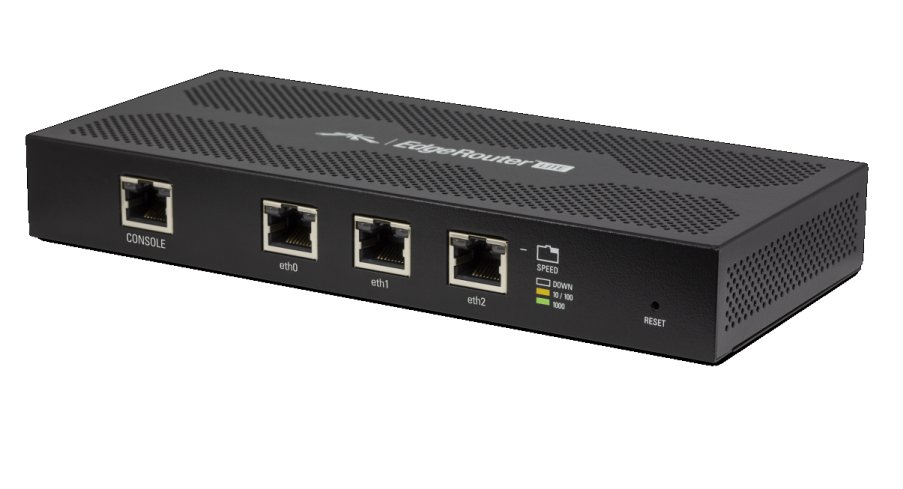

# Ubiquiti EdgeRouter Lite

**Quick Links:**
* [Official spec sheet](https://dl.ubnt.com/datasheets/edgemax/EdgeRouter_DS.pdf)
* [Software/firmware downloads](https://www.ui.com/download/edgemax/edgerouter-lite)
* ["Which EdgeRouter Should I Use?"](https://help.ubnt.com/hc/en-us/articles/219652227--EdgeRouter-Which-EdgeRouter-Should-I-Use-)

Ubiquiti's EdgeMax platform is the closest thing you can get to an enterprise
grade router for less than $200. I bought my EdgeRouter Lite (ERL) for my first
apartment almost five years ago and I have never once regretted my decision.
The only time I've ever thought about giving it up was when I briefly thought
about buying a bigger EdgeRouter.

The EdgeMax/EdgeRouter operating system, creatively named EdgeOS, is a fork of
the open source [VyOS](https://vyos.io/) and is loaded with excellent features
and a killer web UI.

The ERL is fanless and sports three gigabit ethernet ports, as well as a
dedicated serial console port for when I inevitably lock myself out.

It's also rackmountable:
* [EdgeRouter Lite rackmount kit](http://www.ispsupplies.com/categories/Indoor-Enclosures/KAM-Fab-UB-RM1.html)

---

*Last updated `{{ git_revision_date }}`*
