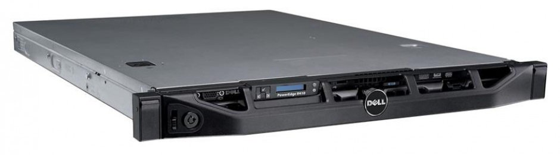

# Dell PowerEdge R410

**Quick links:**

* [Official Spec Sheet](https://www.dell.com/downloads/emea/products/R410_spec_sheet.pdf)

The PowerEdge R400 series is a full-depth dual-CPU server platform that usually
has a 4x3.5" drive arrangement, but did have a variant with 6x2.5" drives as
well. The R410 generation uses DDR3 ECC memory and supports the
[Gulftown](https://ark.intel.com/content/www/us/en/ark/products/codename/29886/gulftown.html) generation of Intel CPUs.

The backbone of my homelab is made up of two Dell R410's: `romulus` and
`remus`. Together the form the bulk of my system's compute power, storage
capacity, and hosting capabilities. Even with as much stuff as I have crammed
onto them I am still nowhere near to using their full potential.

| Hostname | Model | CPU | Memory | Storage | OS |
|----------|---|---|---|---|---|
| `remus`  | 2010 PowerEdge R410 | Intel Xeon e5500 Series | 48GB DDR3 ECC |  4x WD Red 3TB, RAID 5 | CentOS 7.5 |
| `romulus`| 2011 PowerEdge R410 | Intel Xeon x5600 Series | 96GB DDR3 ECC |  4x HST Travelstar 146GB, RAID 5 | CentOS 7.5 |

## Romulus

Romulus is the newer of the two servers, coming from the 2011 series of the
R410. It has a standard 4x3.5" drive configuration and two Intel Xeon x5600
series CPUs. I've installed a Dell PERC h310 and four 146GB 10K SAS drives in
it, giving it considerably higher R/W throughput rates than its companion.

## Remus

Remus will always be special because it was my first server, literally pulled
out of a dumpster my sophomore year of college. Since then I've replaced the
motherboard, drives, backplane, CPUs, and memory (which admittedly does start to evoke the [Ship of Theseus](https://en.wikipedia.org/wiki/Ship_of_Theseus)).

Remus is older than Romulus, coming from the 2010 generation of the R410. Like
Romulus it also has the standard 4x3.5" drive configuration, however it houses
four 3TB Western Digital Red NAS drives which make up the bulk of the homelabs
data storage capacity. The Intel Xeon e5500 series processors also make it
slightly slower than Romulus, though it has more memory.

Remus also sacrificed its DVD drive to host a 256GB SSD boot drive which runs the host operating system.

## Configuration

My preferred server-side operating system is [CentOS](https://www.centos.org/),
and as such both Romulus and Remus are running CentOS 7.5 on bare metal.

Both are configured to run [KVM for virtualization](../virtualization/vms.md) and Romulus is setup with an instance of the Open Virtualization Manager (OVirt) to manage the virtual machines running on both hosts.

See the [configuration section](../config.md) for more information.

---

*Last updated `{{ git_revision_date }}`*
